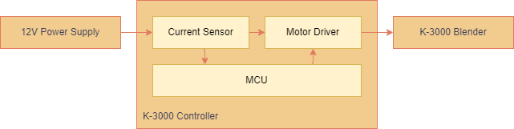

# k-3000-controller
Smart controller for K-3000 hand blender.

## Features

- **Non-instrusive**: The controller is a non-intrusive device. It controls the blender with original power inputs.
- **Control over internet**: Both WiFi and Bluetooth are supported. The project provides a default wifi interface. By proper proxy setting, it can be controlled from anywhere in the world.
- **Count each stroke**: The device "knows" the stroke being executed by measuing the motor current. It empowers user to add any arbitrary delay between strokes.

## Images

